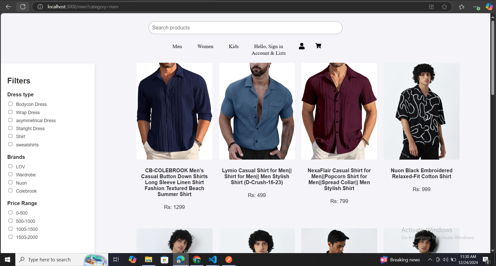
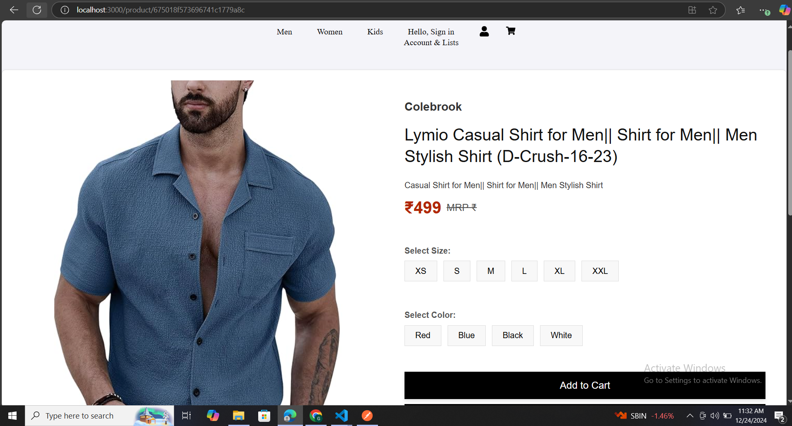

<h1 align="center" id="title">E-Commerce Project</h1>

<h2>🛠️ Installation Steps:</h2>

<p>1. Install Packages</p>

```
npm install
```

<p>2. In the projectory directory you can run</p>

```
npm start
```
<h2>💻 Project UI</h2>
<h3>Home Page</h3>

<h3>Products Page</h3>

 <h3>Product Details Page</h3>
 

<h2>💻 Built with</h2>

Technologies used in the project:

*   NodeJs
*   ReactJs
*   MongoDB
*   ExpressJs
